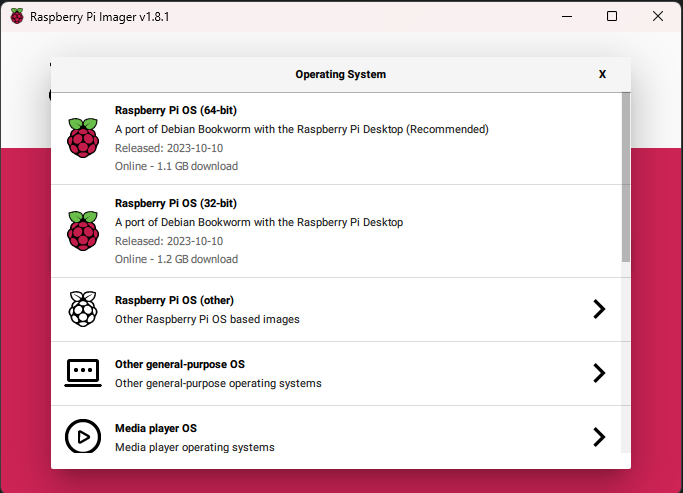

# How to Install Raspbian 🍓

In this section, I will guide you through the process of installing Raspbian, the official operating system for Raspberry Pi. Raspbian provides a user-friendly environment and is optimized for Raspberry Pi hardware. Follow these steps to get your Raspberry Pi up and running with Raspbian.

## Prerequisites 🛠️

Before you begin, ensure you have the following:

- A Raspberry Pi
- Power supply for your Raspberry Pi
- MicroSD card (minimum 8GB, recommended 16GB)
- A computer with an SD card reader
- An internet connection

## Step 1: Download Raspberry Pi Imager
Raspberry Pi Imager is the quick and easy way to install Raspberry Pi OS and other operating systems to a microSD card, ready to use with your Raspberry Pi.

To download it, <a href="https://rptl.io/imager" target="_blank">Click here</a>, or head to: <a href="https://www.raspberrypi.com" target="_blank">www.raspberrypi.com</a> -> Software -> Install Raspberry Pi OS using Raspberry Pi Imager.

After the installer is downloaded, run it. Once Installed, open Raspberry PI Imager, you should see something like this:

> **Note: Appearance of Raspberry Pi Imager**
>
> Please note that the appearance and user interface of the Raspberry Pi Imager software may change over time as updates are released. The screenshots provided in this guide serve as general guidance to help you understand the process of installing Raspbian. While the specific buttons and options may look slightly different in the future, the core steps and procedures outlined here will remain relevant. If you encounter any variations in the user interface, simply follow the equivalent options to complete the installation.
>
> If you have the latest version of Raspberry Pi Imager and encounter significant changes or issues that affect the installation process, please consider opening an [issue ticket](https://github.com/GyufiThePenguin/Homeserver-for-Dummies/issues) on our project's GitHub repository. This will allow us to address your concerns and maintain the accuracy of the guide for future users.

> **Note: Windows Smart Screen Problem**
>
>On windows Systems, Smart Screen may show a notification that this program is from an unknown source. In this case, just click "More Options", than "Install anyway".

>**Note: Official Video Guide 📹**
>
>In addition to this written guide, there is an official video guide provided by [Raspberrypi.com](https://www.raspberrypi.com). Please note that the official video guide may use an older version of Raspberry Pi Imager for demonstration purposes.
>
>The official video guide can provide visual assistance and a real-time walkthrough of the flashing process. However, we recommend using this written guide. Feel free to use the official video guide as an additional reference if it helps you better understand the steps involved in installing Raspbian on your Raspberry Pi.
>To watch the video guide, [Click Here](https://www.youtube.com/watch?v=ntaXWS8Lk34)

## Step 2: Flashing the OS 📁

Flashing an operating system means writing it to the microSD card, making it ready for use in your Raspberry Pi. Follow these steps to flash the Raspbian OS to your microSD card using the Raspberry Pi Imager:

1. **Connect the microSD Card:** Insert the microSD card into your computer's SD card reader.

2. **Choose Your Device:** In the Raspberry Pi Imager, click on the "Choose Device" button. Select your Raspberry Pi model from the list.
  

3. **Choose the OS:** We recommend using the "Raspberry Pi OS (32-bit)" option. At the time of writing, the 64-bit version may have some stability problems. Select this option from the list.
  

4. **Choose Storage:** Make sure the microSD card is properly inserted in your computer. It should appear in the list of available storage devices. Select the microSD card to specify it as the target for flashing the OS.
    > **WARNING:** 
    >Everything on the SD card will be deleted!

      

5. **Click Next:** After confirming your choices, click the "Next".
  

6. **OS Customization:** Raspberry Pi Imager will prompt you for OS customization options. Click "Edit settings" to configure the following:
  

   - **Set Username and Password:** Check the box and fill in your desired username and password for the Raspberry Pi.

   - **Configure Wireless LAN:** If you want to set up a wireless connection, check the box and fill in your wireless network information.

   - **Set Locale Settings:** If applicable, check the box and fill in your locale settings, including language and time zone.

     

7. **Enable SSH:** Click on the "Services" tab at the top of the Raspberry Pi Imager and check the box for "Enable SSH." This allows you to access your Raspberry Pi remotely using SSH.
    >**What is SSH?**
    >
    >SSH, which stands for Secure Shell, is a way to talk to another computer securely over the internet. It's like having a secret language to have private conversations with your computer, and it's commonly used by tech experts to control and manage computers from a distance or move files around safely. It's important because it keeps your information safe when you're using the internet to talk to other computers.

      

8. **Click Write:** After customizing the settings, click "Save", than click "Yes" button to apply customization.
  
 The Raspberry Pi Imager will ask for a confirmation for flashing process. Click "Yes".
  
 The Raspberry Pi Imager will complete the flashing process and write the customized Raspbian OS to the microSD card.

9. **Done** With these steps, you have successfully flashed the Raspbian OS to the microSD card and customized the installation settings according to your preferences.

      

## Step 3: Insert the MicroSD Card

Once the image is written to the microSD card, insert it into your Raspberry Pi.

## Step 4: Power On Your Raspberry Pi

Connect your Raspberry Pi to a monitor, keyboard, and mouse. Plug in the power supply and turn on your Raspberry Pi.

## Step 4: Power On Your Raspberry Pi

You can now connect your Raspberry Pi to a monitor, keyboard, and mouse to start the initial setup. Plug in the power supply, and turn on your Raspberry Pi.

**Note:** If you prefer not to connect your Raspberry Pi to a monitor, keyboard, and mouse or you don't have the necessary hardware available, you have the option to set up your Raspberry Pi in headless mode. "Headless" means you can configure and control your Raspberry Pi without a monitor and interact with it remotely using another computer or device. We will cover the headless setup in a later section of this tutorial. But if you choose to do so now, follow [How to enable VNC Server on Raspbian over SSH](./02_How-to-enable-VNC-Server-on-Raspbian-over-SSH.md).

## Step 5: Initial Setup

Follow the on-screen instructions to complete the initial setup of Raspbian. This typically includes configuring your language, time zone, and creating a password for the default user 'pi.'

Congratulations! You have successfully installed Raspbian on your Raspberry Pi. You are now ready to explore and use your Raspberry Pi for various projects and server applications.

  

# Well Done! 👏

You've successfully completed the installation of Raspbian on your Raspberry Pi! With the operating system ready to go, you're now set to explore various projects and server applications. The next step is to power on your Raspberry Pi and perform the initial setup, which includes configuring your language, time zone, and creating a password for the default user 'pi.'

To continue your journey, head over to the next tutorial page: [LINK_TO_NEXT_TUTORIAL_PAGE](add the link to the next tutorial page here). There, you'll find more guidance on unleashing the potential of your Raspberry Pi for your specific needs.

    

