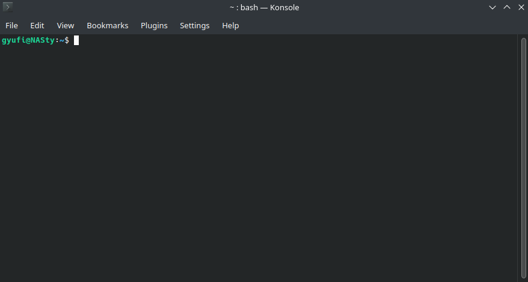

# Milestone 02 - First Steps 🚶

Welcome to Milestone 02 of your "Home Server for Dummies" journey! You've made it past the initial setup and installation phase, and now it's time to explore the world of basic services that can turn your humble Raspberry Pi or Ubuntu server into a versatile powerhouse. But wait, you might be wondering why this milestone looks a bit like a fruit salad – that's because we're about to mix apples and oranges! Don't worry, it's not a culinary experiment but a tech one, and it makes perfect sense.

You see, both Raspberry Pi and Ubuntu are Debian-based systems. It's like discovering that apples and oranges are actually cousins – they share a common lineage, and that lineage is Debian. So, we're merging these tutorials not because they're similar (because they're not, just like apples and oranges), but because they both happen to be fruit... I mean, Debian-based systems! 

From this point onward, the tutorials will largely be the same for both Raspberry Pi and Ubuntu, thanks to their shared Debian heritage. However, when there are differences, we'll be sure to highlight them. So, think of it as a tasty fruit salad where apples and oranges coexist harmoniously, with the occasional sprinkle of uniqueness.

## What the heck is Linux?🐧
Now that we installed it, we should know wat it is, right? Linux is the operating system that powers your computer, just like Windows or macOS. But it's special because it's open-source, which means it's free for everyone to use, and lots of smart people work together to make it awesome.

### But we installed Raspbian/Ubuntu, what does it have to do with Linux?
Imagine Linux as a giant pizza, and Linux distributions (distros) are like different flavors or toppings on that pizza. While the core ingredients are the same, each distro adds its unique spices and toppings. So, you can choose the pizza that suits your taste. Some are super fast and simple, while others come with lots of fancy features. It's like picking your favorite ice cream flavor - they're all based on the same creamy ice cream, but they have different flavors and toppings that make each one special. Distros let you choose the Linux experience you like the most! 

- **Raspbian:** Imagine Raspbian as a special operating system designed for a tiny, powerful computer called the Raspberry Pi. It's like a kid-friendly playground where you can build your own games, websites, and even your own Netflix. It's perfect for learning and creating.

- **Ubuntu:** Now, think of Ubuntu as a really friendly and easy-to-use version of Linux for bigger computers. It's like having a super clean room where everything is neat and tidy, and you can get work done without any fuss. It's great for everyday tasks, just like using your computer for homework, watching movies, or chatting with friends.

Both Raspbian and Ubuntu have a secret language called the terminal, but don't worry, it's not as scary as it sounds. It's like a magic wand where you can tell your computer what to do. Instead of clicking with a mouse, you type commands to make things happen. It's a bit like talking to your computer in its own special language, and it's a lot of fun once you get the hang of it.

### And now to scare you away, we must introduce some important parts of linux:

- **Terminal**: The big black box. Think of the terminal as a magical wand that lets you talk to your computer in a secret language. Instead of pushing buttons, you write commands, and your computer does exactly what you tell it to. It's like you're the wizard, and the computer is your trusty owl following your instructions.
  

- **sudo**: `sudo` is like having a superhero cape. When you need to do something really important or powerful, you put on the cape. It stands for "Superuser Do." So, if you want to install new software, update the whole system, or make changes that affect everything, you say "sudo" before your command. For instance, you can use `sudo apt install firefox` to install the Firefox web browser.
  

- **apt**: Now, think of `apt` as your loyal butler. He's always ready to get things for you. Let's say you want to install a new app, like a game. You'd ask your butler `apt` nicely, saying something like, "Hey, apt, can you please get me that cool-game?" And he does it. You'd simply type `sudo apt install cool-game` to get that game installed.

With Linux, you're in control of your computer, like a conductor leading an orchestra. The terminal, `sudo`, and `apt` are your tools to might look scary, but don't worry; we're here to guide you through the adventure! 🚀

